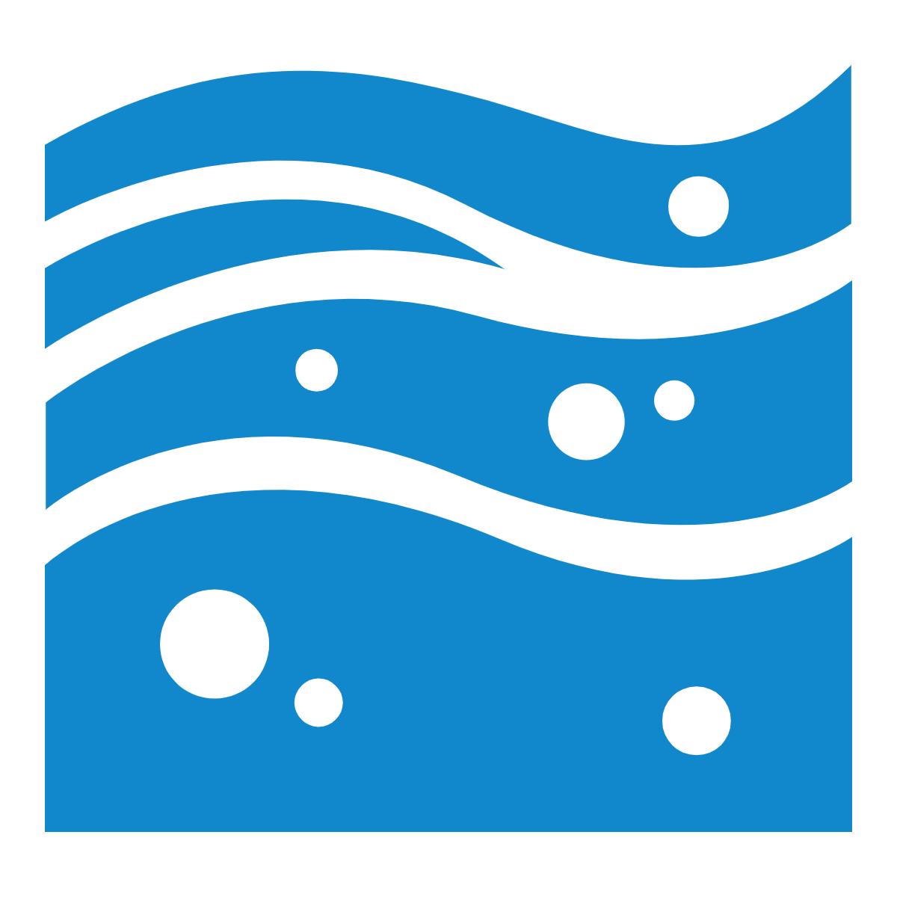

::: {.hero}
::: {.hero-logo}

:::

<h1 class="hero-title">Walker Environmental Research</h1>

[Environmental Data Science & Engineering]{.hero-subtitle}

::: {.hero-tagline}
Finding new ways to manage, share, and understand environmental data.
:::

::: {.hero-actions}
[View Projects](projects.qmd){.btn .btn-hero-primary}
[Get in Touch](contact.qmd){.btn .btn-hero-outline}
:::

::: {.hero-social}
[ Bluesky](https://bsky.app/profile/walkerenvres.bsky.social){aria-label="Bluesky"}
[ LinkedIn](https://www.linkedin.com/in/jeffrey-d-walker/){aria-label="LinkedIn"}
[ GitHub](https://github.com/walkerjeffd){aria-label="GitHub"}
[ ORCID](https://orcid.org/0000-0003-1923-6550){aria-label="ORCID"}
[ Scholar](https://scholar.google.com/citations?user=xOGFHHQAAAAJ&hl=en){aria-label="Google Scholar"}
:::
:::

<h2 class="section-title">Highlighted Projects</h2>

::: {.section-lede}
Databases, models, and interactive data visualization tools built for federal, state, and tribal agencies, universities, and non-profits.
:::

:::{#highlighted-projects}
:::

[View all projects →](projects.qmd){.view-all}

::: {.cta-band}
<h2>Need help with your environmental data?</h2>

I'm always open to new projects and collaborations — from data pipelines and databases to models and interactive visualizations.

[Get in Touch](contact.qmd){.btn}
:::
