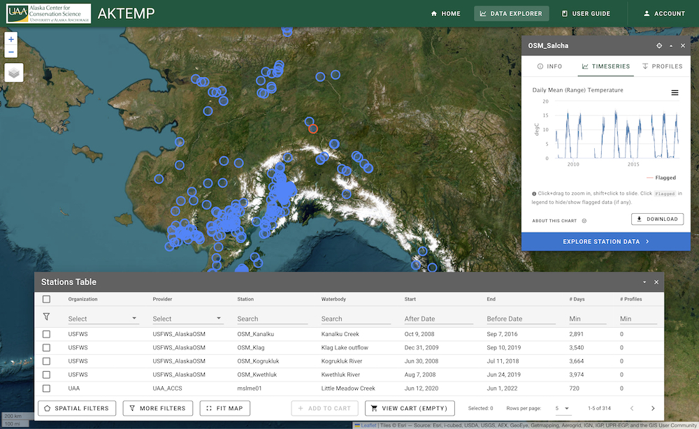

::: {.project-meta}
**Client:** Alaska Center for Conservation Science at Univ. Alaska, Anchorage  
**Period:** 2021-present

[ Website](https://aktemp.uaa.alaska.edu/)
:::

[AKTEMP](https://aktemp.uaa.alaska.edu/) is a water temperature database for exploring, uploading, managing, and downloading stream and lake temperature data across Alaska. The Data Explorer allows users to search, view and download available data. Stations can be filtered by provider, monitoring period, number of measurements, and watershed. The database stores both continuous and discrete temperature data as well as vertical profiles for lakes. Users can upload their data one file at a time, or use the batch upload tool to provide a large number of datasets simultaneously. An integrated QAQC tool allows users to flag abnormal or erroneous data through a point-and-click interface. Data can be downloaded in raw form or as daily timeseries at individual stations, or as a bulk download for multiple stations.

The AKTEMP website is a single-page web application (SPA) built using [vue](https://vuejs.org/), [vuetify](https://vuetifyjs.com/en/), [leaflet](https://leafletjs.com/), and [highcharts](https://www.highcharts.com/). The backend database, API, and other services run on Amazon Web Services using a serverless architecture to minimize hosting costs and maintenance requirements.

This project is a collaboration with the [Alaska Center for Conservation Science](https://accs.uaa.alaska.edu/) at the Univ. of Alaska, Anchorage and [USGS EcoSHEDS project](https://usgs.gov/apps/ecosheds/). Funding was provided by an Exchange Network Grant from the USEPA.
