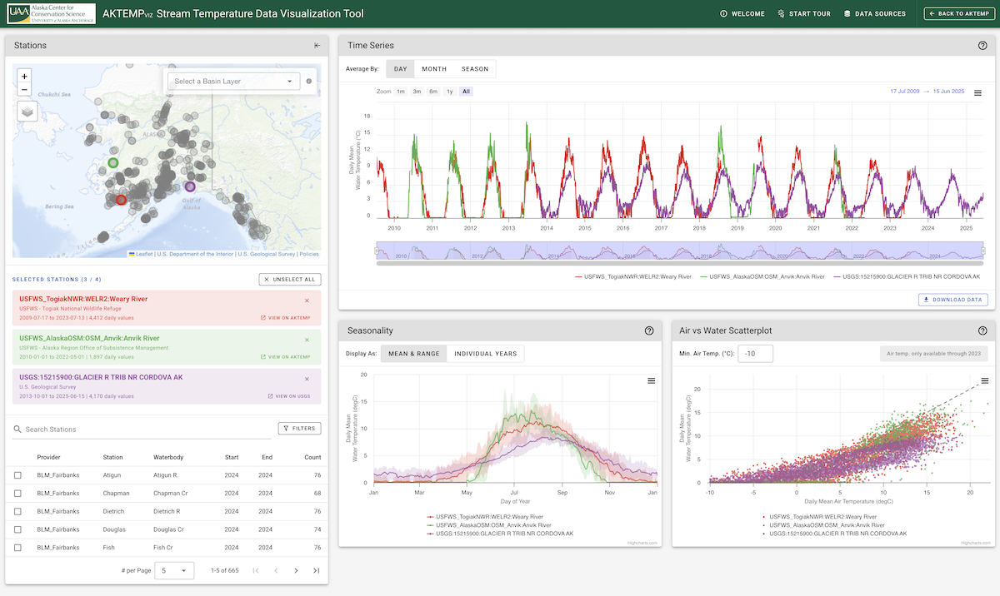

::: {.project-meta}
**Client:** Alaska Center for Conservation Science at Univ. Alaska, Anchorage  
**Period:** 2023-2024

[ Website](https://aktemp.uaa.alaska.edu/viz/)
:::

[AKTEMPVIZ](https://aktemp.uaa.alaska.edu/viz/) is a data visualization tool for exploring air-water temperature dynamics in streams and rivers across Alaska. The tool was designed primarily for data collectors to quickly and easily visualize their data, as well as better understand how water temperatures vary seasonally and spatially across the state. The application was designed based on ideas and feedback from data collectors across the state during an in-person workshop in February 2024. The underlying dataset integrates temperature data not only from [AKTEMP](https://aktemp.uaa.alaska.edu), but also [USGS NWIS](https://waterdata.usgs.gov/nwis) and [NPS IRMA](https://irma.nps.gov/aqwebportal).

This project is a collaboration with the [Alaska Center for Conservation Science](https://accs.uaa.alaska.edu/) at the Univ. of Alaska, Anchorage and [USGS EcoSHEDS project](https://usgs.gov/apps/ecosheds/). Funding was provided by the [Alaska Climate Adaptation Science Center](https://akcasc.org/).
