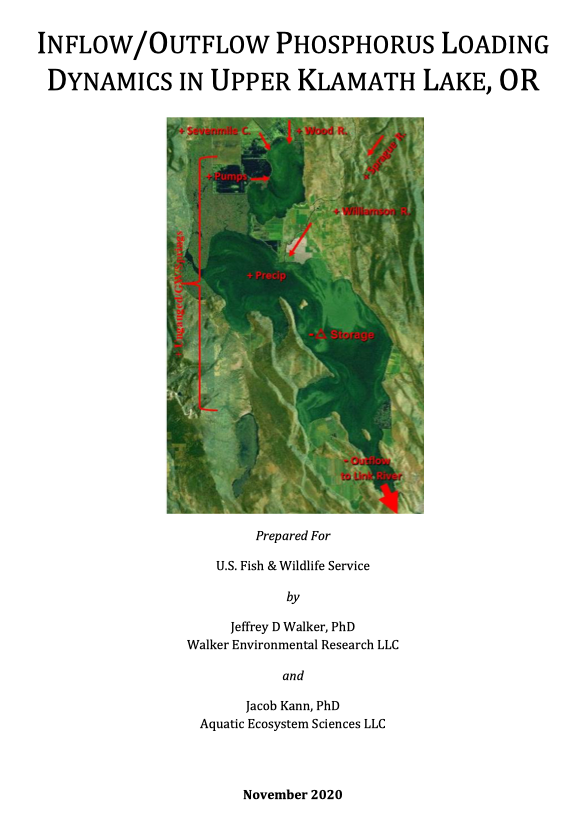
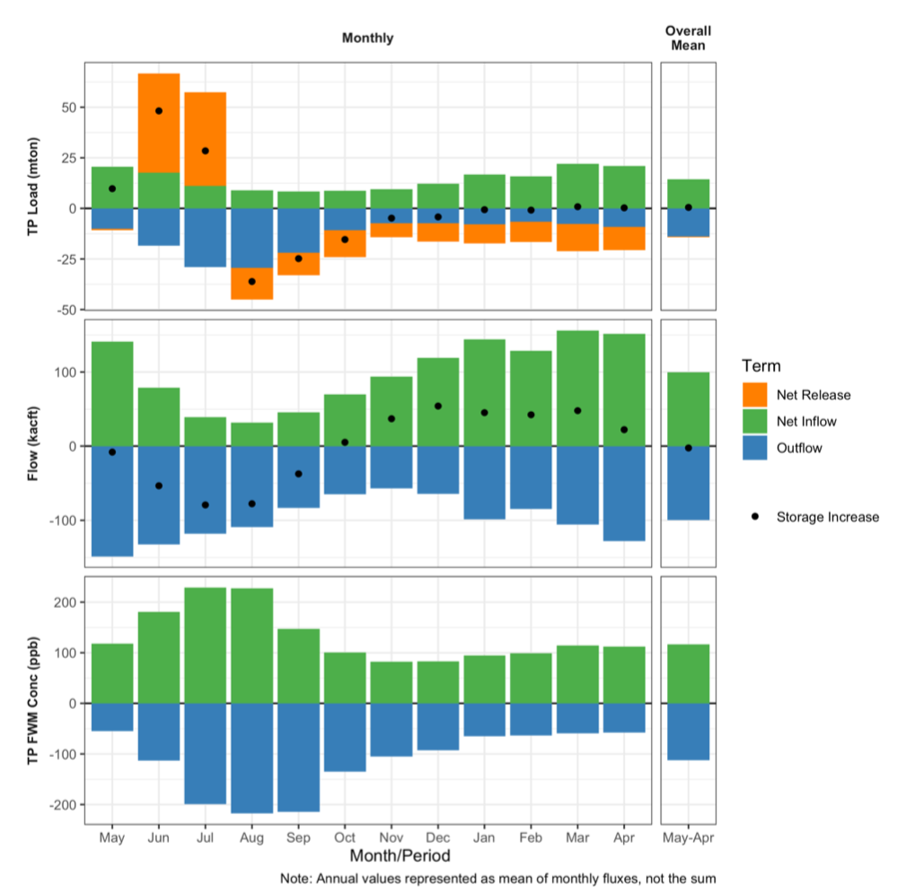
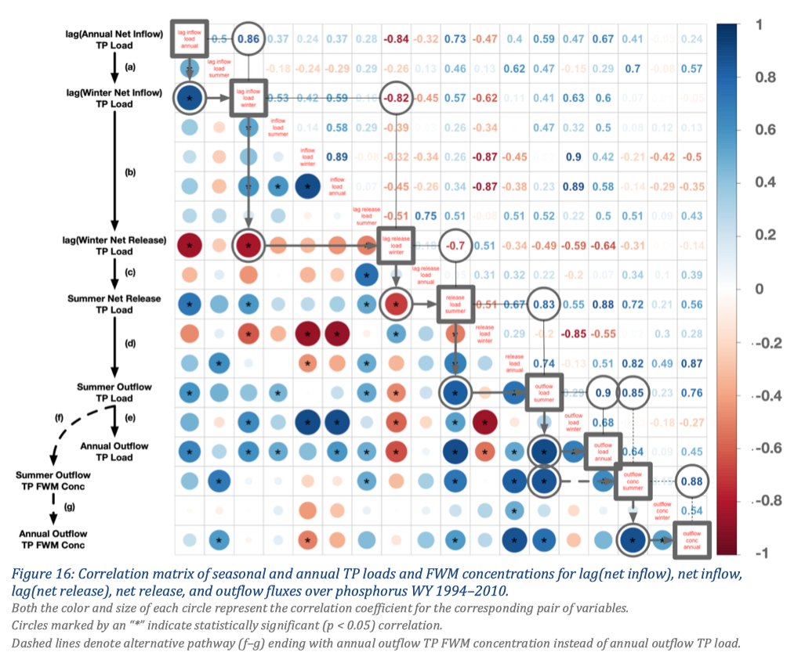

::: {.project-meta}
**Client:** US Fish and Wildlife Service, Aquatic Ecosystem Sciences LLC  
**Period:** 2021

[ Report (PDF)](http://walkerenvres.com.s3.us-east-1.amazonaws.com/reports/2020-klamath-inflow-outflow/USFWS_UKL_Inflow_Outflow_Dynamics-final_20201110.pdf)
:::

## Executive Summary

Upper Klamath Lake (UKL) is a hypereutrophic shallow lake located in southern Oregon, U.S. Poor water quality directly associated with the growth and decline of large cyanobacterial blooms has been identified as an important factor contributing to the decline of native and endangered sucker species. A major driver of these blooms is the release of phosphorus from lake sediments, which generally occurs in the early summer of each year. A preliminary model developed before this study, along with the results of other recent modeling studies of UKL, suggested that outflow total phosphorus (TP) loads may be closely coupled with recent inflow loads, and that in-lake and outflow water quality may respond relatively quickly to external load reductions. To evaluate this hypothesis, we used an existing mass balance dataset containing monthly total flows, TP loads, and flow-weighted mean (FWM) TP concentrations of the lake inflows, outflows, and net sediment fluxes (WY 1992–2010). Our approach focused on 1) developing a better understanding of whether (and how) outflow P loads and concentrations may be driven by recent inflow loads, and 2) determining whether the preliminary linear model that suggested both the current and previous years' inflow TP load had a large effect on outflow loads could be explained or if it was caused by random noise.

We first evaluated and refined a preliminary linear regression model that predicted annual outflow TP loads as a function of current and previous year's inflow loads. We then used exploratory data analysis (EDA) techniques to better understand the seasonal patterns and year-to-year variability of the water and TP budgets. Lastly, we generated correlation matrices of the annual and seasonal fluxes for each mass balance term to determine whether there was evidence supporting the model results that suggested outflow loads and concentrations were coupled with recent (current and previous years) inflow loads in UKL.

Correlations between seasonal and annual mass balance fluxes showed that higher inflow loads in a given year led to higher net retention during the winter, which in turn led to higher net release the following summer followed by higher outflow loads and concentrations. In other words, outflow loads (and concentrations) in any given year were driven in large part by the net release of P from the sediment during the summer growing season, which in turn was driven by inflow loads during the previous winter. Furthermore, because outflow TP concentrations are often representative of the lake-wide mean (i.e., in-lake) TP concentrations, these dynamics affect not only the TP loads and concentrations discharged from UKL, but also the water quality within the lake itself.

Although further research is needed to confirm that these results reflect not just correlation but also causation, they have important implications for implementation of watershed P reduction strategies and underscore the need to implement full scale watershed restoration strategies as rapidly as possible. And while some lag is to be expected between the implementation of watershed restoration activities and reductions in the associated external P loads to UKL, the potential for rapid cycling of external loads through the sediment suggests that improved UKL water quality may occur over relatively short timescales. This improvement in both the water quality within UKL as well as its outflow would benefit the endangered suckers residing within the lake and result in a reduction of nutrients exported downstream to Klamath River.
