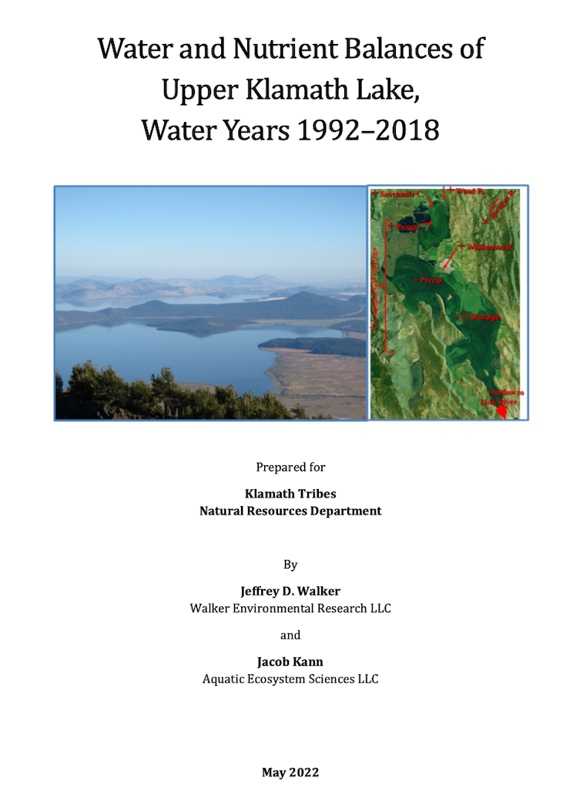
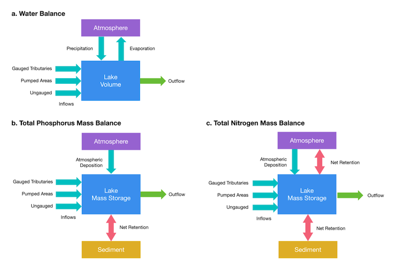

::: {.project-meta}
**Client:** Klamath Tribes Natural Resources Department  
**Period:** 2022

[ Report](https://doi.org/10.5281/zenodo.6607800) | [ Dataset](https://doi.org/10.5281/zenodo.6476839)
:::

*Walker, J.D., and J. Kann (2022). Water and Nutrient Balances of Upper Klamath Lake, Water Years 1992-2018. Technical Report prepared for the Klamath Tribes Natural Resources Department, Chiloquin, OR. 80 pp + Appendices. doi: [10.5281/zenodo.6607800](https://doi.org/10.5281/zenodo.6607800)*

## Study Overview

This report describes the development and analysis of a water and nutrient mass balance dataset for Upper Klamath Lake (UKL) located in south-central Oregon, USA over a 27-year period of record (WY 1992–2018). The dataset contains monthly flows, nutrient (Total Phosphorus and Total Nitrogen) loads, and flow-weighted mean (FWM) concentrations of major mass balance terms representing the inflows, storage, net sediment exchange, and outflows for UKL. The dataset thus documents the long-term and seasonal dynamics of the hydrology and water quality of UKL and its watershed, and provides a basis for evaluating changes in these dynamics and for detecting trends in the lake inflows, storage, and outflows in response to variations driven by climate, land use, and other factors.

In addition to the development of the mass balance dataset, this report also describes a series of analyses that use this dataset to evaluate the seasonal, annual, and long-term hydrologic and nutrient dynamics of UKL. These analyses indicated that over the long term, inflow TP loads were roughly balanced by outflow loads and that there was relatively little overall net retention or release of P from the lake sediment. However, on a seasonal basis, net sediment P fluxes were the primary driver of in-lake and outflow water quality, more so than inflows from the lake watershed. Further analyses indicated that outflow TP loads and concentrations, as well as in-lake water quality, were closely coupled to recent TP inflow loads through rapid cycling between the water column and sediment. Therefore, although seasonal changes in outflow and in-lake water quality were driven primarily by the net release of P from the sediment during the early summer growing season, that net release in turn was related to recent inflow loads.

Links to download:

- [Report](https://doi.org/10.5281/zenodo.6607801)
- [Dataset](https://doi.org/10.5281/zenodo.6476840)
