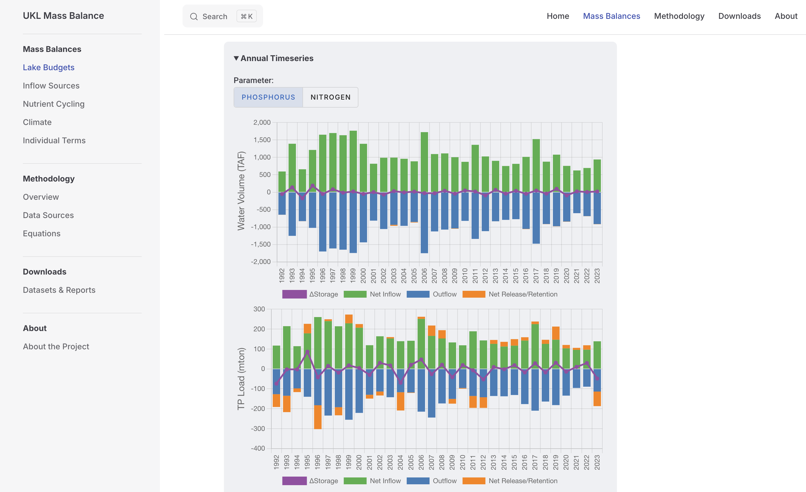

::: {.project-meta}
**Client:** US Fish and Wildlife Service  
**Period:** 2024-2025

[ Website](https://uklmassbalance.org)
:::

A website was developed to provide an interactive interface for exploring the water and nutrient mass balance dataset for Upper Klamath Lake (UKL) using the methodology developed by Walker and Kann (2022). The website allows users to visualize the hydrology and water quality of UKL, including inflows, outflows, storage, and net sediment exchange, as well as seasonal and annual trends in these dynamics.

The project was funded by the [National Fish and Wildlife Foundation](https://www.nfwf.org/) and [Klamath Tribes](https://klamathtribes.org/).
