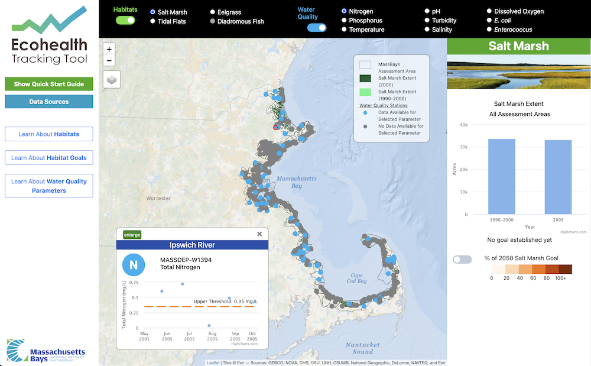

::: {.project-meta}
**Client:** MassBays  
**Period:** 2021-2022

[ Website](http://massbaysecohealth.org/)
:::

The [Ecohealth Tracking Tool](http://massbaysecohealth.org/) is a gateway for the public, scientists, and policy makers to access information about coastal habitats, the water quality conditions that sustain healthy habitats, and the many benefits these habitats provide. The data was developed as a companion to the MassBays [State of Bays report](https://www.mass.gov/service-details/state-of-the-bays).

This project was built by [Hodge Water Resources](http://hodgewaterresources.com/) in collaboration with myself and [Comprehensive Environmental Inc](https://ceiengineers.com/). For this project, I compiled and organized water quality datasets obtained from the USEPA Water Quality Portal, and provided senior technical oversight of the web application development.
