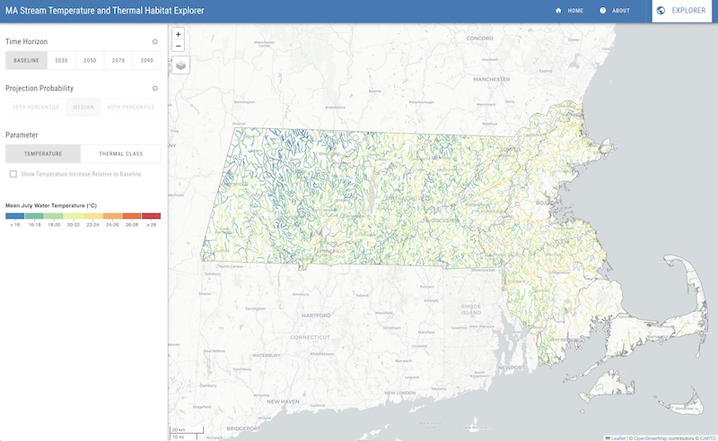

::: {.project-meta}
**Client:** MassWildlife  
**Period:** 2023

[ Website](https://apps.walkerenvres.com/mastath/) | [ Report](https://doi.org/10.5281/zenodo.8145195)
:::

A regional model for predicting stream temperatures at gauged and ungauged streams and rivers in Massachusetts was developed using machine learning and statistical models of air temperature and spatial landscape characteristics. The model was used to project changes in stream temperature and thermal habitat resulting from rising air temperatures due to climate change. The model was comprised of two components: 1) a non-linear regression model representing the functional relationship between air and water temperatures at a single location, and 2) a machine learning model (XGBoost) for estimating the parameters of the air-water temperature model spatially based on landscape characteristics. Together, these models demonstrated strong performance in predicting weekly water temperatures with an RMSE of 1.3 degC and Nash Sutcliffe Efficiency (NSE) of 0.97 based on a 25% hold-out (i.e., validation) subset of the observed data.

The model was used to predict mean July stream temperatures for each stream reach across the state (excluding large rivers with drainage areas > 10,000 km2) based on the 30-yr (1971-2000) normal mean air temperature to represent baseline conditions. Mean July water temperatures were also predicted for a series of climate change projections based on the RCP 8.5 emissions scenario over four 30-yr averaging periods centered on 2030, 2050, 2070, and 2090. For both the baseline and climate change scenarios, the predicted stream temperatures were used to classify each reach based on thermal habitat thresholds for cold- and cool-water fish species. Lastly, the final dataset of predicted temperatures and thermal classes across the state were summarized with maps and figures showing changes in the distribution of thermal classes using the total river miles for each major drainage basin and stream order.

The [report](https://doi.org/10.5281/zenodo.8145195) describes the development and application of the model. The accompanying [website](https://apps.walkerenvres.com/mastath/) provides an interactive data visualization of the study results.
