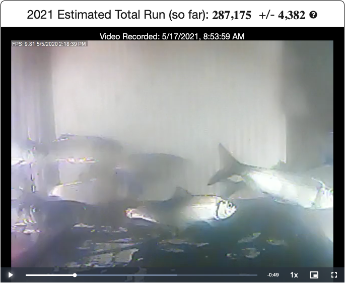
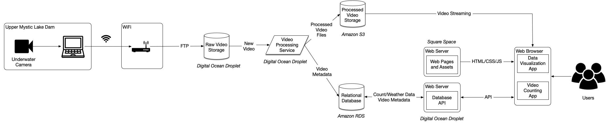
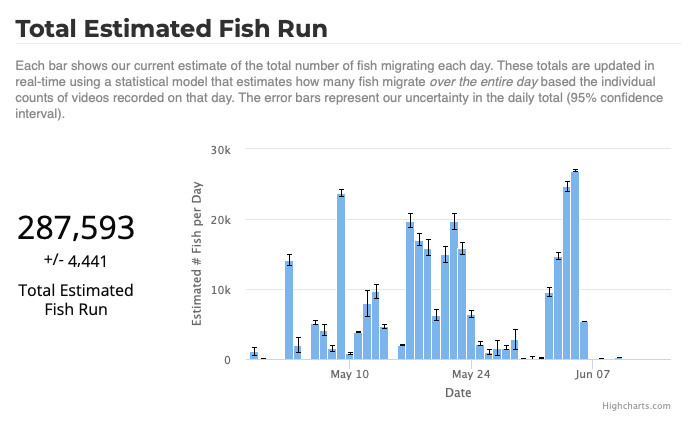
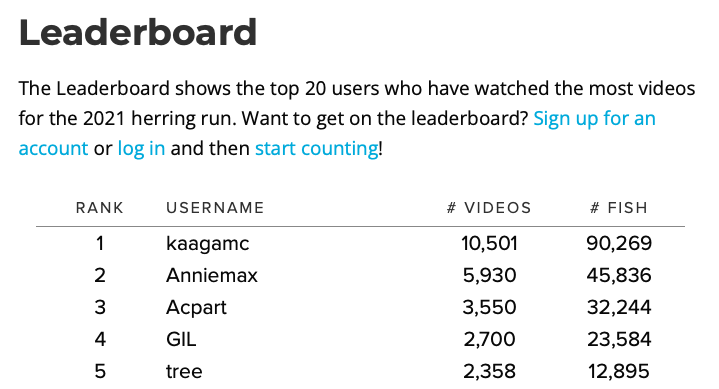

::: {.project-meta}
**Client:** Mystic River Watershed Association  
**Period:** 2017-present

[ Website](https://mysticherring.org/)
:::

Each year, hundreds of thousands of river herring return to spawn in the Mystic River near Boston, MA. For many years, dams and other barriers prevented these fish from reaching their destination.

Since 2012, the Mystic River Watershed Association has managed a volunteer-based monitoring program for counting fish passage. Volunteers are assigned random, 10-minute time slots during which they count fish passing through the Upper Mystic Lake dam. These counts are then analyzed by staff at the Massachusetts Fish and Wildlife to estimate the *total* number of river herring migrating each year.

In 2016, MyRWA parterned with Walker Environmental Research to create a new web-based system for gathering fish counts using under-water videos. The system was designed to automatically capture videos at the dam, which are then uploaded to the cloud, and made available through the project website.

To estimate the total annual run from video-based counts, we adapted the statistical methodology that was being used by MA DFW for tradition volunteer (in-person) counts. The statistical framework was implemented within the relational database, which allows us to estimate the total number of river herring as each video is counted.

To make this project even more engaging, we added a leaderboard feature in 2018, which allows users to compete for the top spot based on the number of videos counted.

Since this project began in 2016, we have added two additional locations in Town Brook (Plymouth, MA) and the South River.
