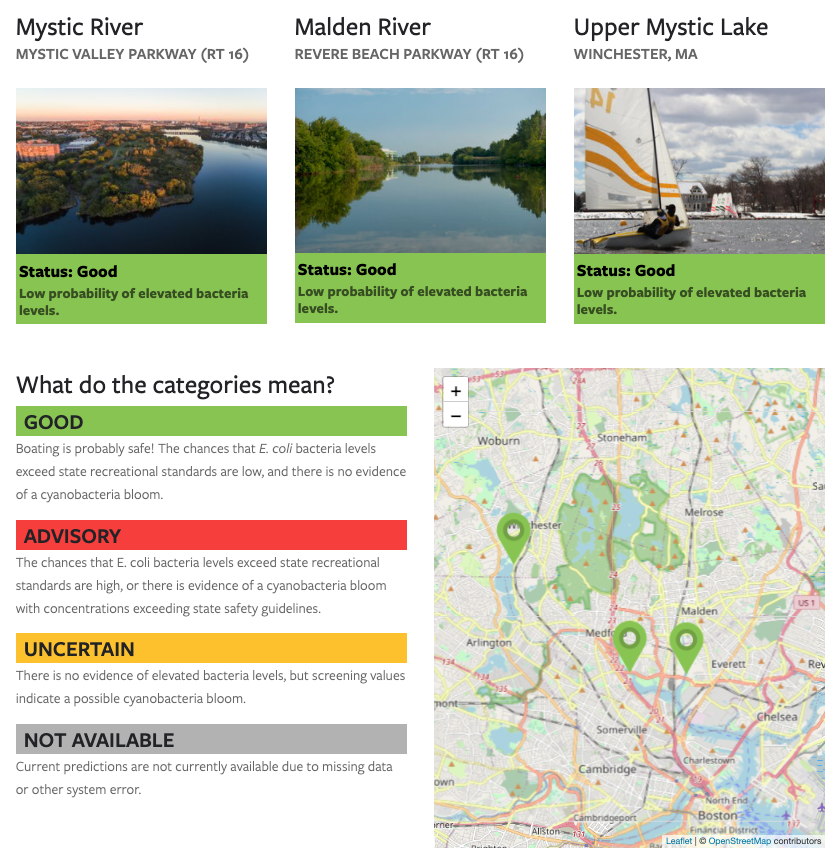

::: {.project-meta}
**Client:** Mystic River Watershed Association  
**Period:** 2016-2017

[ Website](https://mysticriver.org/boatingadvisory) | [ Twitter](https://twitter.com/safemystic)
:::

The [Mystic River Recreational Flagging Project](https://mysticriver.org/boatingadvisory) is a web-based alert system for notifying the public when water quality conditions are expected to be unsafe for boating and recreating.

Each morning, the system predicts the probability of bacteria (either E. coli or Enteroccocus) levels exceeding state recreational water quality standards at each of three locations in the Mystic River watershed. For each location, a logistic regression model was developed based on between 8 and 13 years of historical sampling data. The model predictions are based on input data from nearby streamflow gages and recent weather data (e.g., precipitation). See the [model documentation](https://www.dropbox.com/s/l2btbre8wla8zvw/models.html) for more details.

The daily prediction results are stored in cloud-based database for display on the [project website](https://mysticriver.org/boatingadvisory). The results are also posted each morning by an automated twitter bot [@safemystic](https://twitter.com/safemystic).
