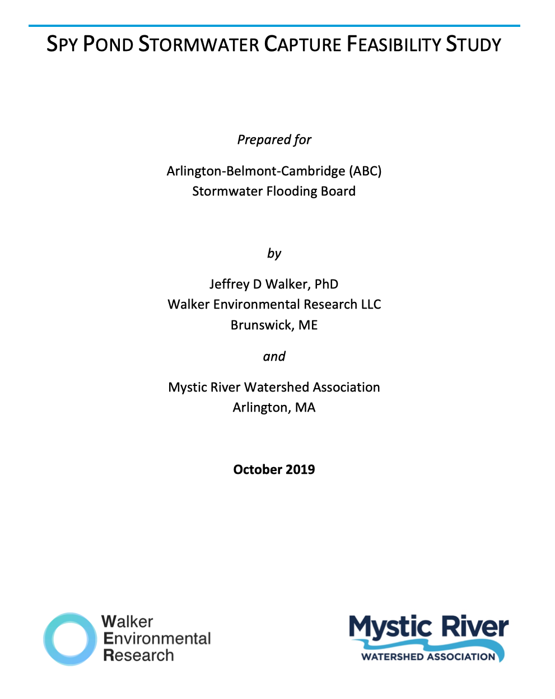
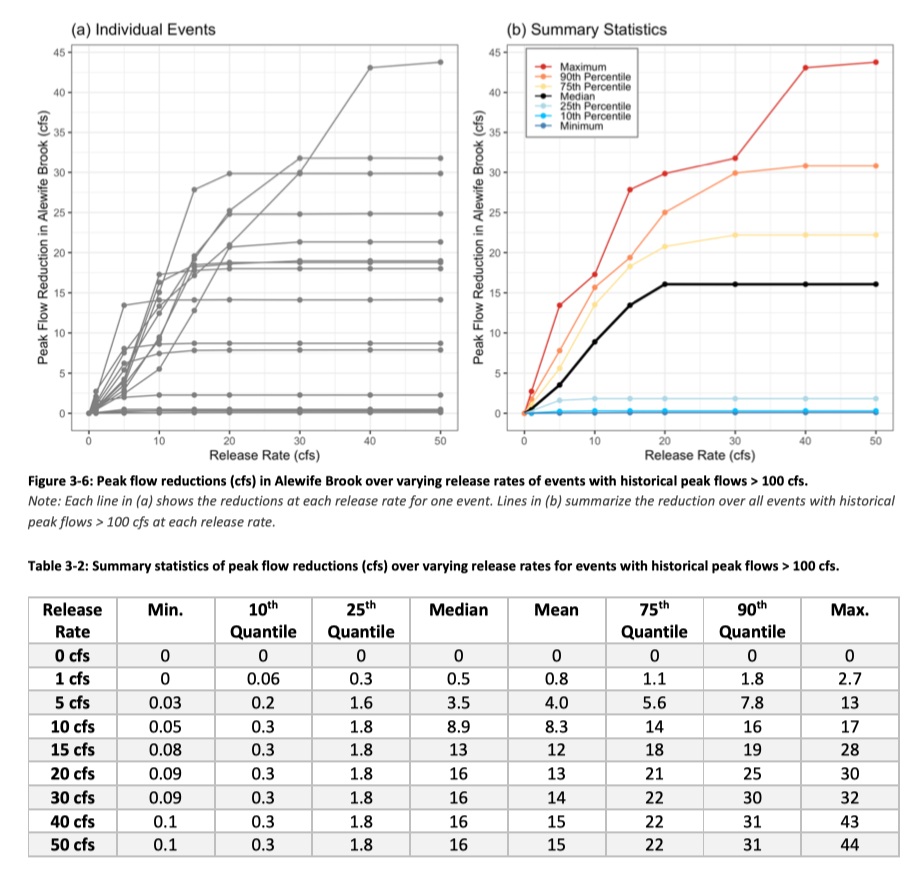

::: {.project-meta}
**Client:** ABC Flood Control Board, Mystic River Watershed Association  
**Period:** 2019

[ Report (PDF)](http://walkerenvres.com.s3.us-east-1.amazonaws.com/reports/2019-mystic-spy-pond/Spy%20Pond%20Stormwater%20Capture%20Feasibility%20Study%20-%20Report%20-%2020191015.pdf)
:::

## Project Summary

The overall goal of this feasibility study is to estimate the potential benefits of operating Spy Pond as a stormwater capture basin in order to reduce downstream peak flows that can cause flooding in neighboring communities along Alewife Brook. A secondary goal was to evaluate whether these operations could also provide benefits in terms of reducing shoreline flooding by preventing the pond water level from rising above flood stages that would cause inundation of private properties surrounding the pond. This study was performed by developing a series of models to simulate the water budget of the pond with and without stormwater capture operations. Although these models were developed using limited available data and based on numerous simplifying assumptions, the results provide a basis for evaluating whether the potential benefits of these operations are sufficient to warrant further investigation through more comprehensive and detailed analyses.

