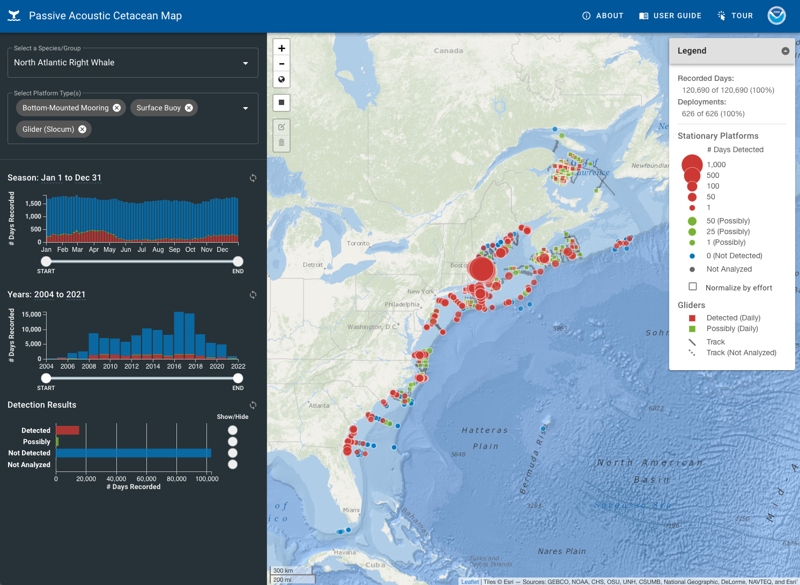

::: {.project-meta}
**Client:** NOAA Northeast Fisheries Science Center  
**Period:** 2021-present

[ Website](https://passiveacoustics.fisheries.noaa.gov/pacm) | [ Press Release](https://www.fisheries.noaa.gov/feature-story/track-whale-detections-interactive-map)
:::

## Project Summary

The Passive Acoustic Cetacean Map (PACM) shows when and where specific whale, dolphin, and other cetacean species were acoustically detected in the North Atlantic Ocean based on Passive Acoustic Monitoring (PAM).

PACM was designed for exploring the spatial and temporal patterns of PAM-based acoustic detection data of cetacean species. A series of interactive data visualization tools can be used to view detections over different seasons, years, and areas. Click the Tour button for a walk-through of how to use this site or see the User Guide for a video tutorial.

Species that are currently represented include the North Atlantic right whale, fin whale, humpback whale, sei whale, blue whale, sperm whale, beaked whale species, and Kogia species (dwarf/pygmy sperm whales). The specific call types used for each species along with other metadata related to the recording and detection analysis can be found by hovering over or clicking on each platform.

Acoustic detections were recorded using stationary (bottom-mounted moorings, surface buoys) and mobile (autonomous gliders and towed arrays) platforms. Stationary platforms are represented using circles with varying sizes that represent the number of days with definite or possible acoustic detections at a fixed location. Mobile platforms are represented using track lines with squares indicating the specific locations where each detection was observed (for gliders, only the first detection of each day is shown). See the User Guide for more information about the map symbology and descriptions of different types of PAM platforms.

These acoustic detections only represent times when animals are calling; they do not capture time periods when animals are present but silent. Detections are from archival acoustic recorders and do not show recorders currently in the water (this is not a real-time tool). Differences in recorder detection ranges for each species are not accounted for; they can vary based on differences in instrumentation (i.e. recording hardware), environmental conditions (i.e. weather, bottom type, ambient sound levels), and anthropogenic sound levels.

Further information about Passive Acoustic Monitoring can be found at the [NOAA NEFSC Passive Acoustic Research Website](https://www.fisheries.noaa.gov/new-england-mid-atlantic/endangered-species-conservation/passive-acoustic-research-atlantic-ocean).
