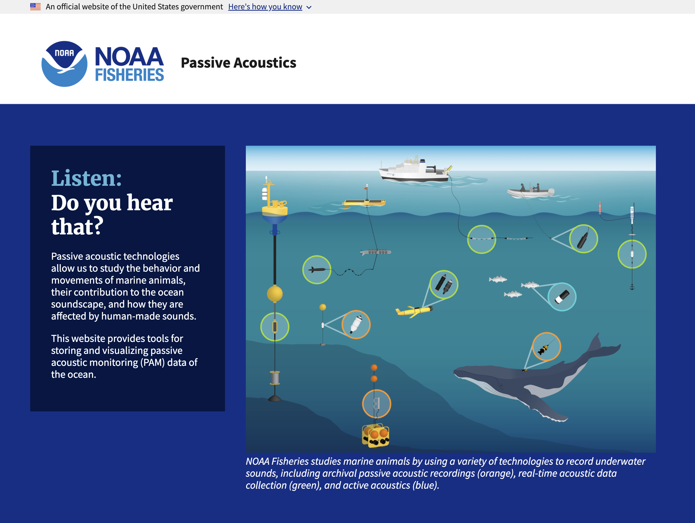

::: {.project-meta}
**Client:** NOAA Northeast Fisheries Science Center  
**Period:** 2024-present

[ Website](https://passiveacoustics.fisheries.noaa.gov)
:::

The NOAA Fisheries Passive Acoustics homepage is a new nation-wide resource for passive acoustic detection data of marine mammals and ocean soundscapes. Currently, the site provides access to the Passive Acoustic Cetacean Map (PACM), but will soon be expanded to also include a data portal for the Makara passive acoustics database, which is currently under development.

This project is funded by the Passive Acoustics Strategic Initiative through the Inflation Reduction Act (IRA).
