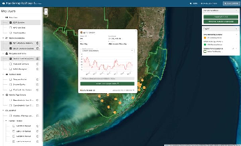

::: {.project-meta}
**Client:** National Park Service  
**Period:** In development
:::

The Florida Bay Dashboard is an interactive dashboard integrating real-time and historical hydrologic and water quality monitoring with weather forecasts, benthic habitat layers, and satellite-derived harmful algal bloom (HAB) imagery. The system includes an automated data pipeline built in R that integrates data from multiple external APIs.

This project is currently in development.
