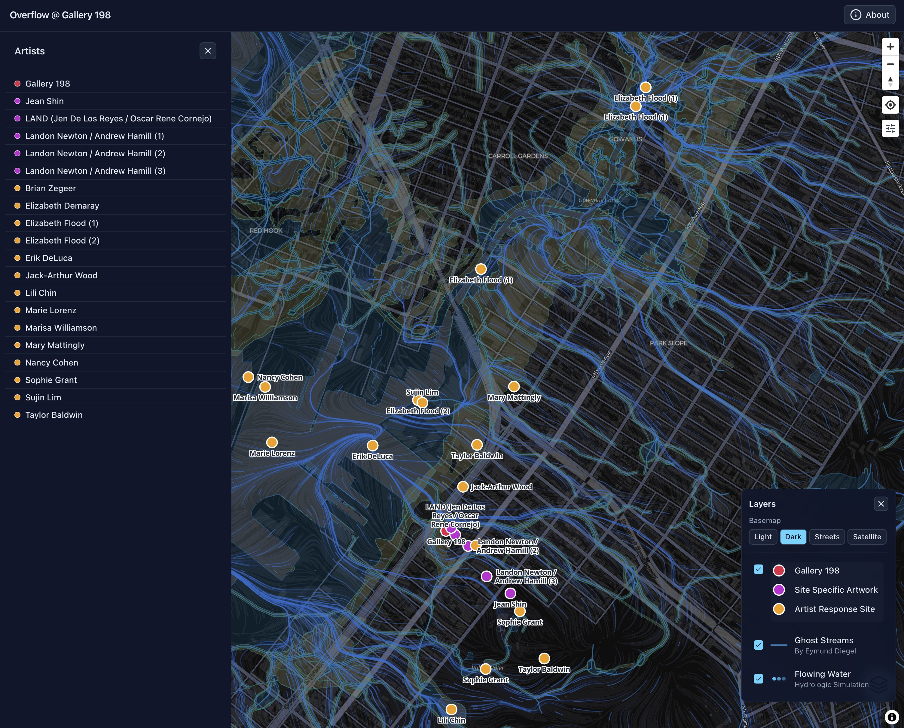
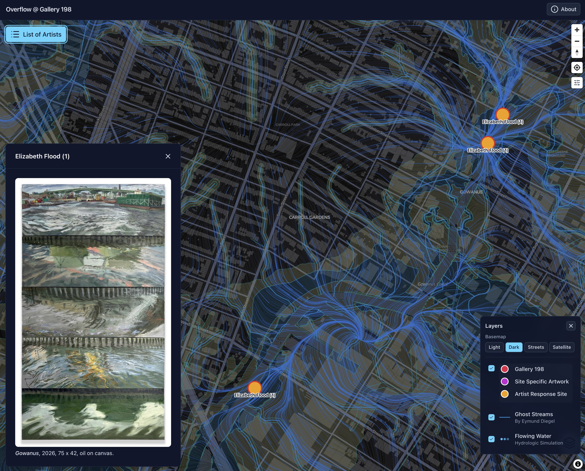
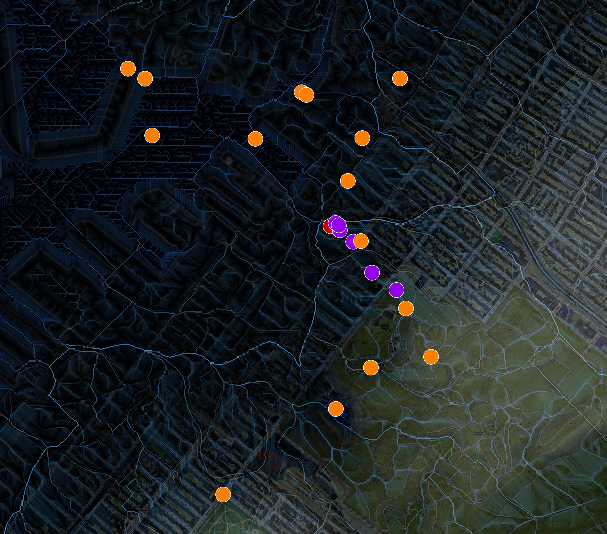

::: {.project-meta}
**Client:** Overflow Exhibition at Gallery 198 (Brooklyn, NY)  
**Period:** 2026

[ Website](https://overflowmap.art/) | [ GitHub](https://github.com/walkerjeffd/overflowmap.art)
:::

<video autoplay loop muted playsinline style="width: 100%;">
  <source src="overflow-demo.mp4" type="video/mp4">
</video>

The [Overflow Map](https://overflowmap.art/) is an interactive web map created for *Overflow*, a site-responsive group exhibition at [Gallery 198](https://www.gallery198.com/) in Brooklyn, NY (July 10-25, 2026). Guest curated by Andrew LaFarge Hamill, the exhibition brought together 21 multigenerational and multidisciplinary artists — all alumni or former faculty of the Skowhegan School of Painting and Sculpture — to explore how we relate to the waterways that support contemporary city life. The exhibition responds directly to the Harbor Hill Terminal Moraine, a glacial ridge where intensified rain events and aging sewer infrastructure have led to the overflow of sewage and pollutants into Gowanus Bay.

The map connects the works in the gallery with their local sources in the surrounding neighborhood, spanning from Green-Wood Cemetery to the Gowanus Canal. Visitors can tap any site to reveal the associated artwork, such as Elizabeth Flood's *Gowanus* (2026), an oil painting composed of five perspectives along the full length of the canal, including a view from a sewage overflow site a few blocks down the hill from the gallery.

To situate the artworks within the hidden hydrology of the neighborhood, the map includes a "Ghost Streams" layer showing the historical streams and wetlands that flowed through the area prior to urban development. This layer was created by [Eymund Diegel](https://www.linkedin.com/in/eymund-diegel-466a9a21), who digitized the historical waterways from old maps (see this [Atlas Obscura article](https://www.atlasobscura.com/articles/finding-brooklyns-ghost-streams-with-old-maps-and-new-technology) about the Ghost Streams project).

The map also features a "Flowing Water" layer: an animated particle simulation showing how water would have flowed over the landscape and along the ghost streams toward Gowanus Bay. The flow field was derived from 1-meter lidar elevation data (USGS 3DEP) using a hydrologic processing pipeline built with WhiteboxTools, GDAL, and Python (rasterio, numpy, shapely). The historical wetlands were "burned" into the elevation surface so that the simulated flow converges along the ghost streams, giving viewers a sense of how water moved through and around the artist response sites before the streets and sewers replaced them.

The application was built using Nuxt, Nuxt UI, and MapLibre GL JS, and runs entirely client-side as a static website hosted on GitHub Pages. Site locations and artwork metadata were managed by the artists in a shared Google Map layer, then exported and processed into GeoJSON files for the app. The map was designed primarily for mobile devices, allowing visitors to navigate on foot between the gallery and the artist response sites throughout the neighborhood.

This project was designed and built by Walker Environmental Research in collaboration with [Andrew LaFarge Hamill](https://www.instagram.com/andrew_lafarge_hamill/), artist and curator of the *Overflow* exhibition.
