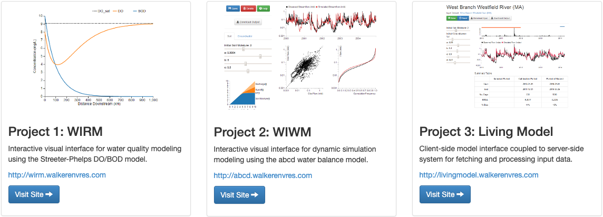

::: {.project-meta}
**Client:** Tufts University  
**Period:** 2014

[ Website](http://phd.walkerenvres.com) | [ Dissertation (PDF)](http://walkerenvres.com.s3.us-east-1.amazonaws.com/academics/thesis/Walker-Tufts-Thesis.pdf)
:::

## Abstract

Mathematical models are central to the study and management of environmental and water resources systems. However, there are major and persistent challenges associated with understanding, communicating, and using models. Over the past two decades, researchers have investigated various ways of using the World Wide Web (the 'web') to improve model accessibility and communication. However, existing research has primarily focused on server-side approaches where the model is executed on the server and the results displayed in the browser as static text and images.

This thesis demonstrates a novel approach to web-based modeling by using client-side web applications to perform model simulations, output visualizations, and user interface control all within the browser using only standard web languages. By performing these tasks within the browser, the interface supports highly interactive visualizations that allow the user to easily explore how the model behaves in response to changing parameters and input data.

A series of demonstrations are presented to illustrate various ways of using client-side web applications to provide interactive modeling interfaces. These applications allow the user to perform simulations, explore model theory and behavior, incorporate observation data, and share models with other users. Client-side web applications for interacting with these models are coupled to server-side data storage and integration systems allowing the user to store model data on a centralized server, and to link models with their input datasets.

The culmination of this research is the concept of a 'Living Model,' which consists of an interactive web application for performing simulations and refining the model over time and a server-side data integration system for automatically updating input datasets as new data become available. The Living Model illustrates the potential for web applications to enhance the model life cycle by improving the accessibility, continuity, and persistence of model simulations.

The research presented in this thesis demonstrates a new approach for creating web-based user interfaces that will fundamentally change how we access, understand, and interact with environmental models. This improved accessibility and interactivity will ultimately lead to better understanding of environmental data, models, and systems and thus more informed research, management, and decision making.
