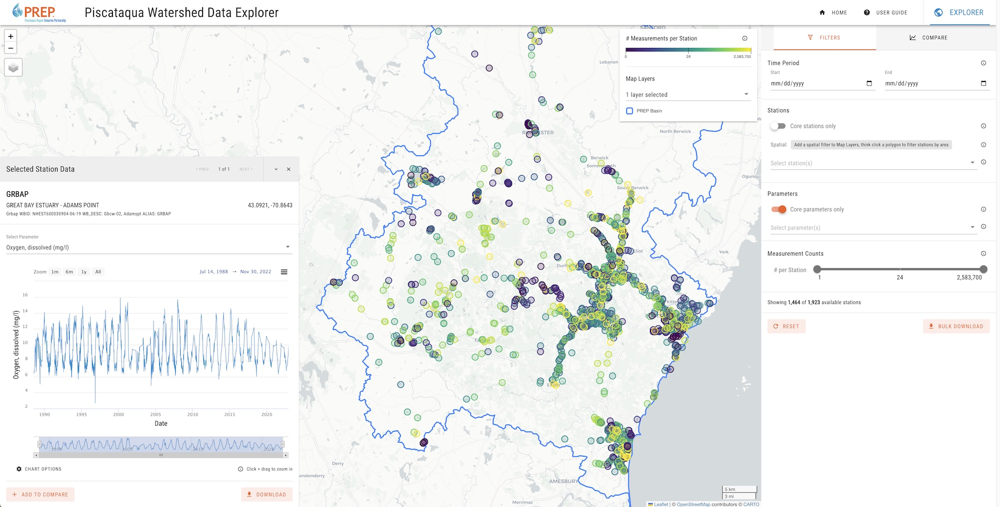

::: {.project-meta}
**Client:** Piscataqua Region Estuaries Partnership (PREP)  
**Period:** 2023

[ Website](http://data.prepestuaries.org/data-explorer/) | [ GitHub](https://github.com/walkerjeffd/prep-data-explorer)
:::

The [Piscataqua Watershed Data Explorer](https://data.prepestuaries.org/data-explorer/) is an interactive data explorer for accessing, visualizing, and downloading water quality data in the Piscataqua River watershed. The data explorer provides direct access to the [Piscataqua Region Estuaries Partnership (PREP)](https://prepestuaries.org/) water quality database, which represents the most comprehensive collection of environmental data for the watersheds of coastal New Hampshire, containing the results from monitoring activities and projects carried out by multiple organizations, including the University of New Hampshire, New Hampshire Department of Environmental Services, and PREP.

In collaboration with [FB Environmental](https://www.fbenvironmental.com/), the data explorer was designed for users to quickly find and download raw water quality data as well as perform basic time-series comparisons between two or more parameters and sites.

The website is a single-page application (SPA) developed using [Vue](https://vuejs.org/), [Vuetify](https://vuetifyjs.com/), [Leaflet](https://leafletjs.com/), [Highcharts](https://www.highcharts.com/). Water quality data are fetched directly from a [PostgreSQL](https://www.postgresql.org/) database using a [PostgREST API](https://postgrest.org/). The database, which was developed and maintained by PREP, follows the [ODM2 schema](https://www.odm2.org/) for environmental data.

The web application source code is publicly available on Github at [walkerjeffd/prep-data-explorer](https://github.com/walkerjeffd/prep-data-explorer).
