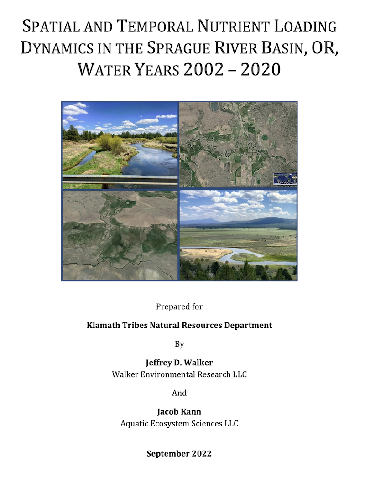

::: {.project-meta}
**Client:** Klamath Tribes Natural Resources Department  
**Period:** 2022

[ Report](https://doi.org/10.5281/zenodo.7377353)
:::

*Walker, J.D. and J. Kann (2022). Spatial and Temporal Nutrient Loading Dynamics in the Sprague River Basin, OR, Water Years 2002 – 2020. Technical Report prepared for the Klamath Tribes Natural Resources Department. 114p. + appendices. doi: [10.5281/zenodo.7377353](https://doi.org/10.5281/zenodo.7377353)*

This study evaluated the streamflow and nutrient dynamics of the Sprague River basin (Oregon) over water years (WYs) 2002 – 2020 using biweekly flow and nutrient measurements collected by Klamath Tribes at eight sampling stations across the basin. Continuous daily timeseries of flows, loads, and concentrations were computed using methodologies similar to a recent [hydrologic and nutrient mass balance study](../klamath-mass-balance/index.qmd) for the entire UKL basin (Walker and Kann, 2022). These daily timeseries were used as a basis to investigate the spatial and temporal dynamics of nutrient concentrations and loads, estimate relative amounts of background and anthropogenic loading, assess the potential impacts of the Klamath Tribes' water rights calls on instream flow and water quality in recent years, and evaluate long-term trends at each sampling station within the Sprague River basin.
