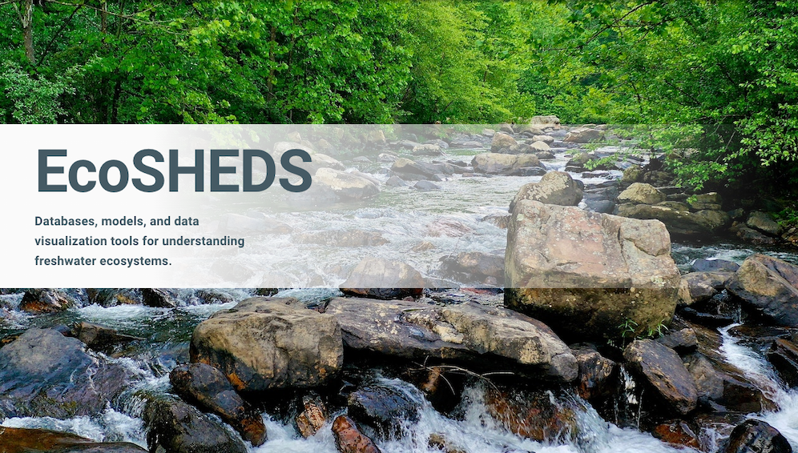

::: {.project-meta}
**Client:** US Geological Survey  
**Period:** 2014-present

[ Website](https://www.usgs.gov/apps/ecosheds/)
:::

[EcoSHEDS](https://www.usgs.gov/apps/ecosheds/) is a collection of Spatial Hydro-Ecological Data Systems (SHEDS) designed to improve our understanding of stream ecosystems. The goal of EcoSHEDS is to provide a series of user-friendly tools for gaining insight and supporting transparent research, management, and decision-making of hydro-ecological resources.

EcoSHEDS began as an integrated [database](http://db.ecosheds.org/), [modeling](https://ecosheds.org/models/stream-temperature/latest/), and [data visualization](https://www.usgs.gov/apps/ecosheds/ice-northeast/) platform for stream temperature across the Northeast U.S. Over the past 8 years it has grown to include a wide array of projects, each of which consists of an integrated platform linking together one or more hydro-ecological databases, models, and data visualization tools.

As the primary developer of EcoSHEDS, I am responsible for the design, development, and implementation of the system architectures, backend systems (databases, APIs, model and data pipelines, etc), and frontend components (web applications, data visualizations).

EcoSHEDS is currently being migrated from an on-premise web server located at UMass Amherst to a serverless architecture running on Amazon Web Services via USGS Cloud Hosting Solutions (CHS).
