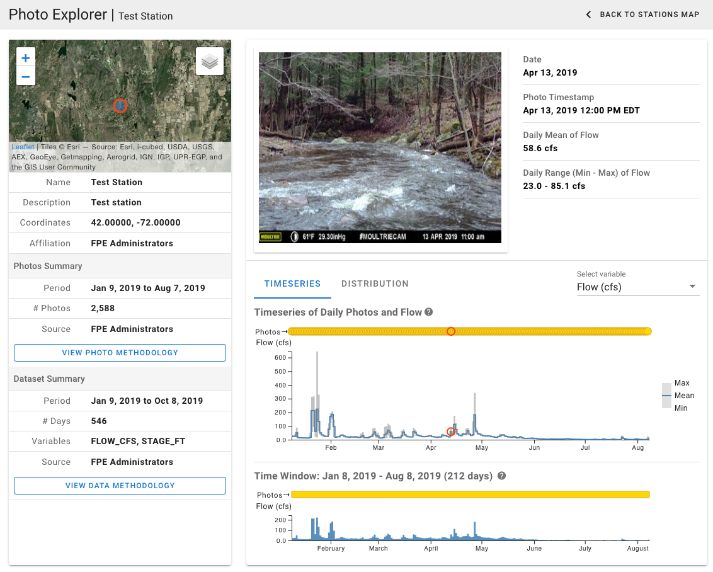

::: {.project-meta}
**Client:** US Geological Survey  
**Period:** 2020-present

[ Website](https://www.usgs.gov/apps/ecosheds/fpe/)
:::

The Flow Photo Explorer (FPE) is an integrated database and machine learning platform for estimating streamflow from timelapse imagery. The goal of this project is to develop new approaches to monitoring hydrologic conditions in streams and rivers where flow data are historically sparse or non-existent.

FPE is being developed in two phases:

- *Phase 1 (complete):* a cloud-based database for uploading, managing, and viewing timelapse imagery coupled with continuous streamflow (or stage) monitoring data.
- *Phase 2 (ongoing):* machine learning models for predicting streamflow from timelapse imagery.

With Phase 1 now complete, FPE provides a user-friendly interface for exploring timelapse imagery and observed streamflow data. Interactive data visualizations allow the user to animate the images and see how each stream changes over time as flows rise and fall.

Data providers can register for a free account to upload their images and monitoring data to a cloud-based database and file storage system.

During Phase 1, a series of preliminary machine learning models were developed by Conservation Science Partners to predict streamflow from the timelapse images. The results of these initial models (forthcoming) showed strong potential for this system to provide an exciting new methodology for monitoring streamflow both with and without observed flow data. In the absence of observed flow data, a novel methodology was developed using human-generated rankings of image pairs that can be used to train a model to rank a series of images from low to high flows. These rankings can then be used to estimate discharge rates using an assumed flow distribution.

In Phase 2 of the project, the preliminary models and methodologies will be refined and deployed to the FPE system for generating automated predictions of streamflows based on uploaded images.

FPE is hosted on Amazon Web Services through USGS Cloud Hosting Solutions (CHS).

This project was a collaboration between the US EPA, USGS, and Conservation Science Partners. It was funded by an Innovation Grant from the US EPA and an AI for Earth Innovation Grant by the National Geographic Society.
