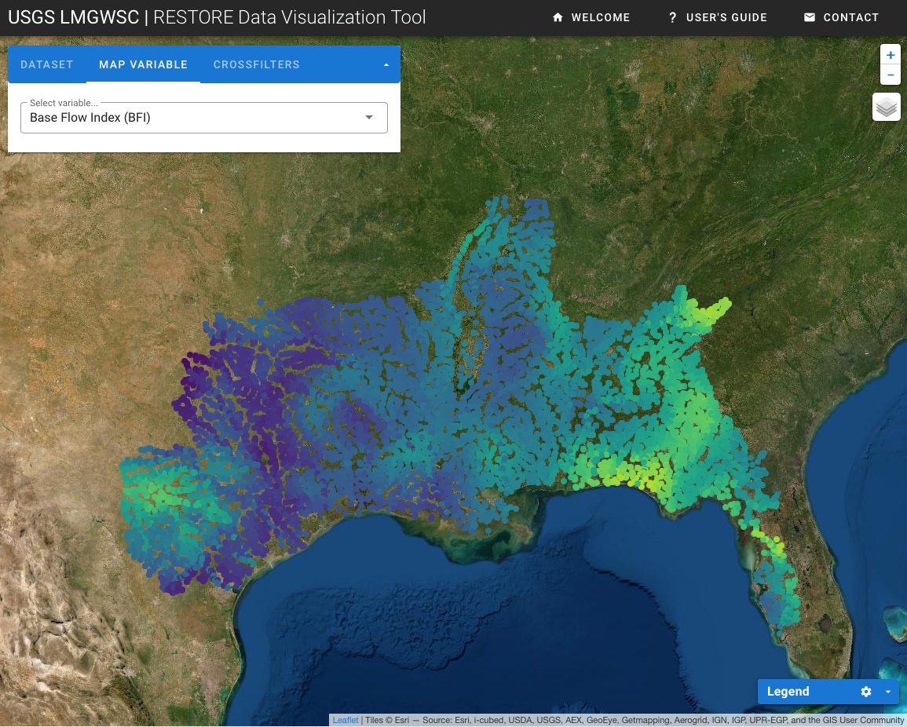

::: {.project-meta}
**Client:** USGS Lower Mississippi-Gulf Water Science Center  
**Period:** 2018-present

[ Website](http://usgs.gov/apps/ecosheds/lmg-restore) | [ GitHub](https://github.com/walkerjeffd/ice-lmg)
:::

The RESTORE Data Visualization Tool was created to interactively explore datasets generated by USGS researchers for the RESTORE project being conducted in collaboration with the US EPA. The purpose of this tool is to help stakeholders, decision makers and other interested users access these datasets and develop a better understanding of spatial and temporal streamflow patterns in the Lower Mississippi-Gulf Region.
