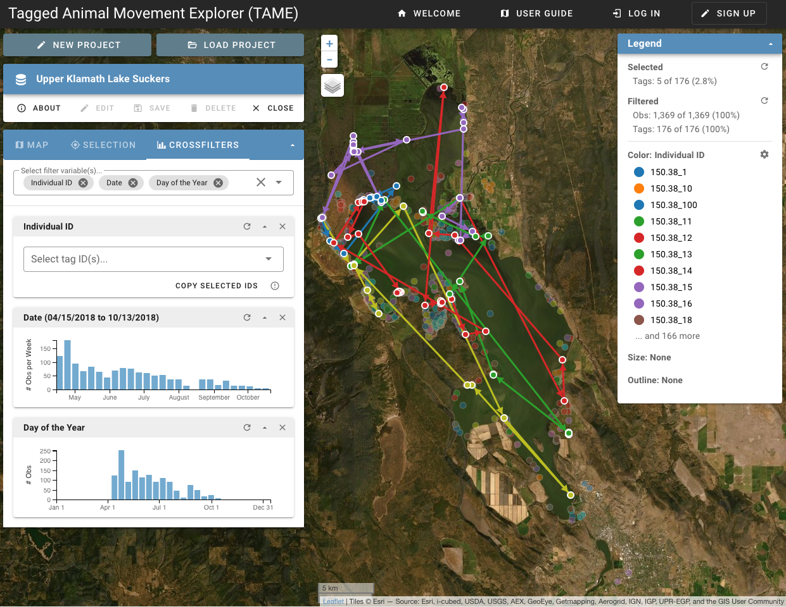

::: {.project-meta}
**Client:** US Geological Survey  
**Period:** 2020

[ Website](https://www.usgs.gov/apps/ecosheds/tame/) | [ GitHub](https://github.com/walkerjeffd/sheds-tame) | [ ScienceBase](https://www.sciencebase.gov/catalog/item/5cd30962e4b09b8c0b7a5cad)
:::

The Tagged Animal Movement Explorer (TAME) is an interactive data visualization tool for exploring spatial and temporal patterns of animal movements.

TAME integrates a map-based view of the animal movements with multi-dimensional cross-filters that can be used to animate movements through time or over any other variable included in the dataset (e.g. the size of each individual or the movement velocity). The ability to filter and animate the movements using virtually any kind of continuous or discrete variable is a unique and powerful component of TAME.

As a client-side data visualization tool, TAME can be used to explore datasets locally by loading files directly into the browser without the need to upload or save data to the server. Users who wish to save their dataset for future exploration or to share with colleagues can register for a free account and then save their dataset to the cloud. Each saved project is given a unique URL that can be shared privately, or published to the public TAME project directory.

TAME was funded by the USGS Community for Data Integration (CDI).
