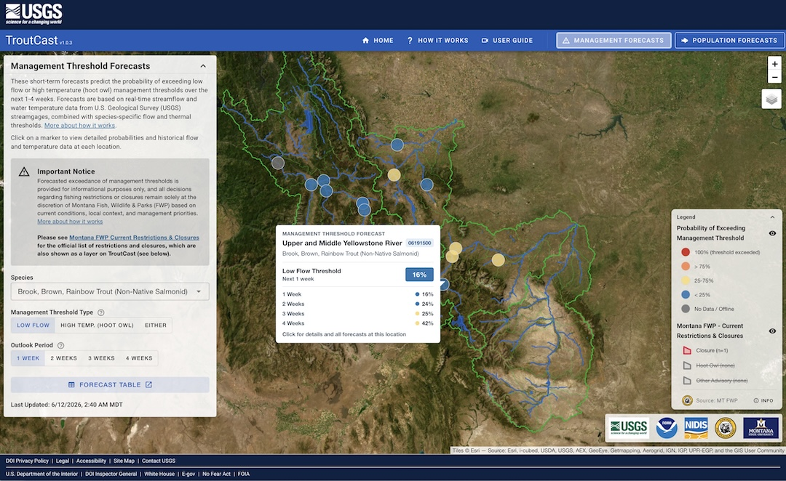

::: {.project-meta}
**Client:** US Geological Survey  
**Period:** 2026-present

[ Website](https://www.usgs.gov/apps/troutcast/)
:::

USGS TroutCast is a web-based dashboard showing real-time predictions of low-flow and high-temperature fishery closures and long-term population forecasts of native salmonid species in Montana. The system is driven by an automated cloud-based model pipeline built in R.

