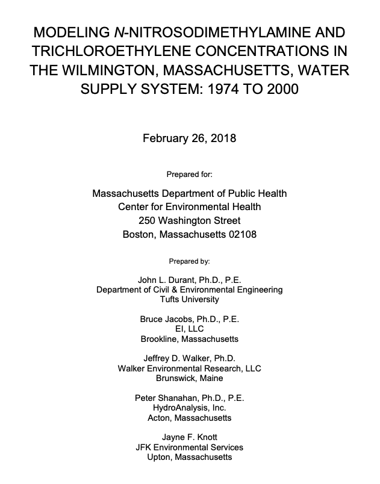
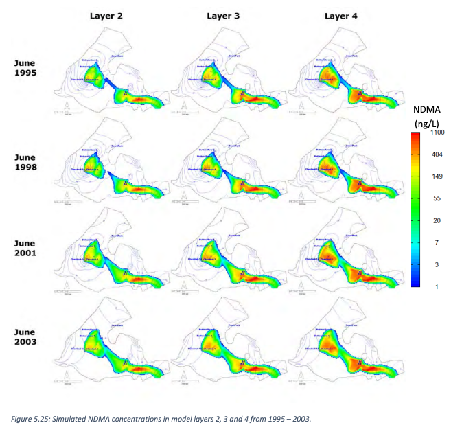
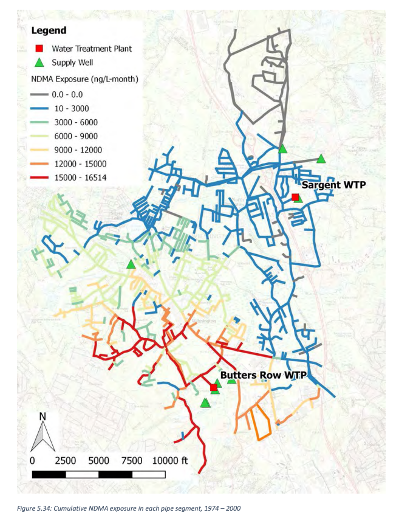

::: {.project-meta}
**Client:** MA Dept of Public Health  
**Period:** 2017

[ Report (PDF)](https://www.mass.gov/doc/appendix-c-modeling-n-nitrosodimethylamine-and-trichloroethylene-concentrations-in-the-wilmington-massachusetts-water-supply-system-1974-to-2000-pdf/download) | [ Press Release](https://www.mass.gov/news/state-study-suggests-link-between-elevated-rates-of-childhood-cancer-in-wilmington-in-the-1990s-and-formerly-contaminated-public-water-supply)
:::

## Executive Summary

Between 1987 and 1995 more children were diagnosed with brain cancer, leukemia, and Hodgkin's disease than expected in two census tracts in Wilmington, Massachusetts, based on state-wide childhood cancer rates. The discovery of N-nitrosodimethylamine (NDMA), a potent carcinogen, in the Maple Meadow Brook (MMB) aquifer led to the hypothesis that exposure to NDMA ‒ and possibly other chemicals including trichloroethylene (TCE) ‒ in the drinking water supply may in part explain the elevated cancer rates. NDMA is believed to have formed in the environment from precursor compounds from chemical manufacturing activities at the former Olin Corporation chemical plant, now a Superfund site, located in Wilmington about ½ mile from the MMB aquifer water supply wells. When these wells were pumping, NDMA that had dissolved into ground water beneath the Olin Site was drawn into the wells and thereby introduced into the Wilmington water supply system. Four of the five water supply wells in the MMB aquifer were permanently deactivated in 2002 and the fifth in 2003. TCE was also found in the water supply wells and in the drinking water distribution system in the early 1980s; however, the source of TCE is unknown.

The purpose of this study was to develop monthly concentration time histories of NDMA and TCE at specific Wilmington addresses for use by the Massachusetts Department of Public Health (MA DPH) in an epidemiological study. The major tasks were to (1) develop ground water flow and transport models to estimate historical NDMA concentrations within the aquifer and at the town water supply wells, and (2) develop a water distribution system model to estimate monthly-average pollutant concentrations in individual water supply pipes between 1974 and 2000 for NDMA and between 1981 and 2000 for TCE. The period 1974 to 2000 was selected for NDMA to bracket the earliest and latest possible exposure dates for children in the health study; 1981 was selected for the start of the TCE study because 1981 was the earliest date TCE was measured in the water distribution system.

To estimate the initial arrival time of NDMA to the wells and how NDMA concentrations at those wells changed over time, ground water flow and transport models were constructed. The underlying conceptual model was based on an earlier ground water model created by the Olin Corporation. The ground water models were configured to simulate changes in the three-dimensional flow field and resulting transport of NDMA through the aquifer at monthly time steps from 1965 through 2003. This simulation period begins earlier and ends later than the primary study period (1974 – 2000) in order to simulate the initial dispersion of NDMA into the aquifer, and to produce results that can be compared to measured concentrations collected in 2003 at each supply well.

The ground water flow and transport models were developed using MODFLOW and MT3D, respectively. The flow model was calibrated to historical measurements of potentiometric head at monitoring wells located across the model domain and at various depths. The transport model was calibrated to NDMA measurements in the water supply wells collected in 2003. Sources of NDMA were specified by assigning constant concentrations in areas with known high concentrations located deep within the MMB aquifer. Previously, the primary source of NDMA was believed to be dense aqueous phase liquid (DAPL) resulting from waste disposal and located in deep bedrock depressions near the Olin site. Our model results suggest the existence of an additional DAPL source of NDMA located within the MMB aquifer near the water supply wells in depressions known as the Western Bedrock Valley. This additional source is supported by measurement data collected within the aquifer. NDMA was also assumed to be a conservative substance not subject to formation or decay within the aquifer.

Based on historical records, which suggest that NDMA reached the MMB aquifer near the water supply wells in the early 1970s, the ground water model simulations estimate that NDMA reached the Chestnut St. #1 well in 1974 and the Butters Row #1 well in 1981. These two wells contained the highest NDMA concentrations ranging from approximately 50 to 250 ng/L. Both Butters Row #2 and Chestnut St. #1A/2 wells contained lower levels of NDMA and were contaminated for shorter periods of time relative to the Butters Row #1 and Chestnut St. #1 wells. Measurements indicate that NDMA did not reach the Town Park well, which was located farther to the north in the MMB aquifer relative to the other wells.

A hydraulic model of the Wilmington water distribution system was also developed using a commercially available software application, WaterCAD, to simulate the transport of NDMA and TCE from the supply wells and Butters Row Water Treatment Plant (WTP) to each point in the town's distribution system. The distribution model was based on a model of the system that had been developed for the town's water department in 2001 as well as various studies carried out for the water department, historical logs of system improvements reported in the town's annual reports, assessor's maps, and road maps. NDMA concentrations were specified for the supply wells and the Butters Row WTP using the results of the ground water model. The NDMA simulations of the water distribution system were performed at monthly time steps from 1974 through 2000. For TCE, the simulation period spanned from June 1981, when the Butters Row WTP was brought online, through 2000. The ground water model was not used to simulate TCE transport due to a lack of information on potential sources to the aquifer. Therefore, the TCE concentrations in water discharged from Butters Row WTP were based on historical measurements collected at the WTP. For both NDMA and TCE, all other water supply sources outside the MMB aquifer were assumed to have concentrations of zero. Both contaminants were also assumed to be conservative substances meaning they were not subject to chemical reactions that would result in their formation or decay within the distribution system.

The water distribution system model was evaluated by comparing simulated TCE concentrations against measurements collected at six locations throughout the system on July 31, 1986. The spatial penetration of contaminants into the system was found to primarily depend on the proportion of water discharged from the contaminated supply wells in the MMB aquifer and from the Butters Row WTP relative to the total town-wide water supply rate. The magnitude of concentrations in the distribution system strongly depended on the concentrations of the MMB aquifer source wells and the WTP. The contaminant distribution also depended to a lesser extent on the water demands of industrial and commercial users relative to domestic users, and on the pipe network configuration, which varied over the simulation period.

Based on the water distribution model results, simulated NDMA concentrations steadily increased from 1974 to June 1979 due to the initial contamination of the Chestnut St. #1 well. The extent of NDMA within the system, however, was relatively small with 31% of all pipes exceeding 1 ng/L and 12% exceeding 50 ng/L. From July 1979 to May 1981, all wells in the MMB aquifer had been deactivated except Town Park, which was not contaminated with NDMA. However, when the Butters Row WTP was brought online in June 1981, NDMA concentrations rapidly increased. From 1981 through 2000, the spatial extent and magnitude of NDMA in the system varied widely from month to month, with the monthly mean and maximum concentrations computed across all pipes ranging from 5 – 39 ng/L and 12 – 114 ng/L, respectively. The percent of all pipes in the system with concentrations exceeding 50 ng/L reached a peak of 63% in November 1991. In March 1998, 27% of all pipes had concentrations exceeding 100 ng/L. NDMA exposure was primarily limited to the southern, central and western areas of town; exposure in the northern and eastern areas was relatively low because these areas primarily received water from uncontaminated sources (i.e., the northern water supply wells and Sargent WTP).

The water distribution model results also showed that TCE exposure was greatest from 1983 through 1986 due to high levels observed at the Butters Row WTP. Similar to NDMA, the greatest cumulative exposure occurred in locations near the Butters Row WTP within the southern, central and western areas of town. The highest TCE levels occurred in 1985 when the mean TCE concentration across all pipes reached 26 ug/L, and 60% of all pipes had concentrations exceeding 20 ug/L. From 1990 through 2000, TCE levels were below detection limits at the WTP and across the system.

Sensitivity analyses were performed to evaluate the impact of alternative model configurations, parameters, and input datasets on model results. For the ground water flow model, the sensitivities to alternative spatial discretization, simulation time step durations, and various hydraulic parameters were evaluated by comparing changes in the simulated potentiometric head at monitoring well locations near the MMB aquifer wells. The sensitivity of the water distribution model to diurnal variability in water demands was also evaluated.

Primary sources of uncertainty in the model results include the inability to simulate the transport of DAPL with conventional modeling tools, and uncertain knowledge with respect to (1) the timing, location, and source strength of contaminant source areas, (2) the assignment of historical pumping rates, and (3) the representation of changes in the physical configuration and operation of the water distribution system. An uncertainty analysis was performed by varying both the arrival time of DAPL to the Western Bedrock Valley in the MMB aquifer, and the pumping rates for supply wells during the period when pumping data were most limited. The results of this analysis provide uncertainty ranges of monthly NDMA concentrations for each pipe in the distribution system to be incorporated in the analyses performed by MA DPH.
